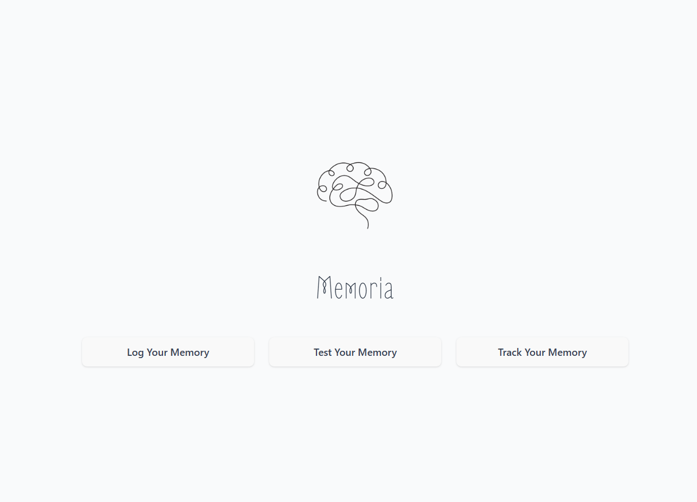

# Memoria — Local Alzheimer’s Memory Companion

A fully local-only, privacy-first app that helps people living with Alzheimer’s (and their families) log memories, practice gentle recall, and track progress over time with a calm Zen stones metaphor — powered by an on-device GPT-OSS:20B model.

> “Because every memory matters.”

---

## ✨ Features

- 🧠 **Local-only AI** – Runs entirely on-device using **GPT-OSS:20B**, with optional fallback for reliability. Handles question generation, answer checking, and supportive feedback.

- 📝 **Memory Logging** – Capture life’s moments with entries that include 📸 photos, 🧍 names, 📅 events, 📍 places, and 🗒️ notes.

- 🎯 **Personalized Tests** – Generates 3–5 short questions based on your own journal entries for meaningful, memory-based reflection.

- 🪨 **Zen Stones Progress** – Each correct answer stacks a calming stone. Build towers as a gentle, visual signal of progress.

- 💬 **AI Feedback** – Receive warm, actionable tips tailored for both users and caregivers to foster growth and emotional support.

- 🚨 **Safety Alerts** – If your recent average score drops below **50%**, the system offers to notify a trusted contact for timely help.

- 📴 **Offline-first Design** – Works seamlessly without internet. All data is stored locally for privacy, speed, and peace of mind.

---

## 🛠️ Tech Stack

**Frontend (UI Layer)**  
- ⚛️ **React (Vite)** — Lightweight, fast, local-first interface  
- 🎨 **Tailwind CSS** — Clean, responsive design system  
- 📱 **PWA-ready** — Installable, mobile-friendly app experience  

**Backend / Core Engine**  
- 🟢 **Node.js + Express** — Local backend logic, API routes, and middleware  
- 🗃️ **SQLite (memories.db)** — Local-only database for storing entries, test results, and progress  
- 📦 **Sequelize/Custom Models** — Memory schema & ORM-style access (via `backend/models/memory.js`)  
- 🧩 **Custom Logic** — Memory logging, test generation, scoring, and caregiver alerts  

**AI & Processing**  
- 🤖 **GPT-OSS:20B (via Ollama runtime)** — Local LLM powering question generation, scoring, and AI feedback  
- 🔄 **Backend Integration** — LLM runs through Node.js API calls, keeping all computation offline  

**Media & Design**  
- 🗣️ **ElevenLabs** — AI narration for demo and accessibility (not runtime app dependency)  
- 🖼️ **Figma** — Design mockups and UI prototyping  
- 🪨 **Zen Stones Visualization** — Unique UX metaphor for tracking progress and stability  

> 🔐 **Privacy-first design**: Everything — storage, logic, and AI — runs fully **on-device**. No external API calls. No cloud storage.  


---
## 🧭 Architecture Overview

Here's how Memoria is structured under the hood:


---
## 📺 Demo Video

🎥 [Watch the Memoria Demo on YouTube](https://youtu.be/07mKm7GgE84?si=Mt5-NDHhiJThePcE)

---

## 🧠 Powered by GPT-OSS:20B

Memoria integrates **GPT-OSS:20B**, a powerful open-source local LLM, to create a truly personalized memory companion.  
Instead of generic tests, the model works directly with your logged memories to provide meaningful, supportive interactions.  

Each session includes:  
- 📝 **Personalized Memory Quizzes** — Questions generated from your own entries (names, events, places)  
- 🎯 **Smart Scoring** — Evaluates answers in natural language, not just exact matches  
- 🪨 **Zen Stones Tracking** — Correct answers add to a calming visual progress tower  
- 💡 **Supportive AI Feedback** — Encouraging insights, strengths, and gentle reminders  
- ⚠️ **Early Decline Alerts** — Detects when performance drops and prompts caregiver notification  
- 🔐 **Local-First Processing** — All AI runs on-device; no data ever leaves your system  

> GPT-OSS:20B transforms Memoria into more than an app — it becomes a compassionate, intelligent companion for those living with Alzheimer’s and their families.  


---

## 🖼️ App Screenshots

| Home Screen | Log Screen | Flower Screen | Day Summary Screen | Weekly Progress Screen | Week Summary Screen |
|-------------|---------------|----------------|-------------|---------------|----------------|
|  |  |  |  |  |  |

---
## 🚧 Future Enhancements

Shichi is designed to grow gently over time. Here are some planned features and ideas for future versions:

- 📅 **Monthly Tracking & Summaries** – Reflect on progress across full months
- 📆 **Custom Retention Window** – Let users change how many days to retain logs (beyond 7)
- 🧠 **Model Choice Toggle** – Support switching between Gemma, Mistral, or LLaMA 3 via Ollama
- 🗓️ **Yearly Wellness Overview** – Visualize trends over the year   
- 🔔 **Optional Logging Reminders** – Gentle nudges to encourage daily check-ins  
- 🌍 **Multi-language Support** – Starting with German, Japanese, and more

> 💡 Have ideas to contribute? Open an issue or start a discussion — I'd love to hear from you!

---

## 🚀 Local Setup

```bash
git clone https://github.com/HarshavardhanaNaganagoudar/shichi.git
cd shichi
```
---

## 📄 License

This project is licensed under the **Creative Commons Attribution-NonCommercial 4.0 International (CC BY-NC 4.0)** license.

You are free to:

- ✅ Share — copy and redistribute the app in any medium or format  
- ✅ Adapt — remix, transform, and build upon the app

Under the following terms:

- ✍️ **Attribution** — You must give appropriate credit, link to this license, and indicate if changes were made.  
- 🚫 **NonCommercial** — You may not use the material for commercial purposes.

🔗 [View the full license terms here](https://creativecommons.org/licenses/by-nc/4.0/)
